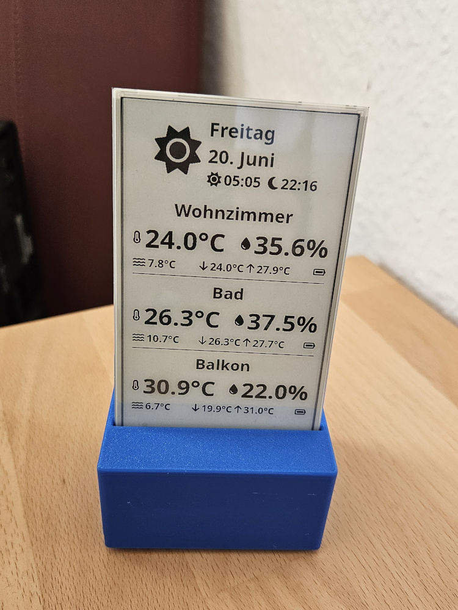
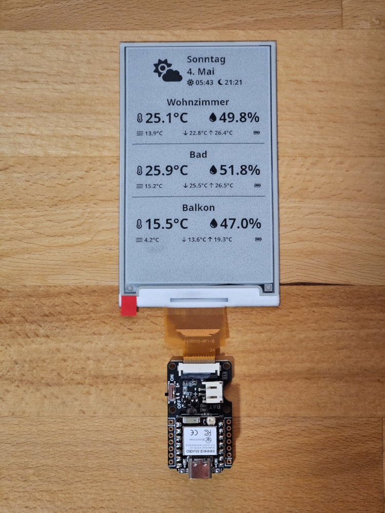

# Weather Display



A weather display system consisting of a server component and a display component. This project allows you to display weather and temperature information on an e-ink display.

The server component connects to a Home Assistant instance and retrieves data from there. This information is used to build an html dashboard, which gets rendered into a portable bitmap.
The e-ink display periodically queries that dashboard and displays it.

## Part List

- Seeed Studio XIAO ESP32C6 - https://www.seeedstudio.com/Seeed-Studio-XIAO-ESP32C6-p-5884.html . Either get the version with pre-soldered pin headers or solder them on yourself. The un-soldered pack already includes the pin headers (check part list).
- Seeed Studio ePaper breakout board - https://www.seeedstudio.com/ePaper-breakout-Board-for-XIAO-V2-p-6374.html
- GooDisplay 4.26inch E-ink-Display 800x480 GDEQ0426T82 (Black/White) - https://eckstein-shop.de/GooDisplay-426inch-E-ink-Display-800x480-SPI-E-Paper-GDEQ0426T82 . This is identical to https://www.seeedstudio.com/4-26-Monochrome-SPI-ePaper-Display-p-6398.html .
- Some USB-C power supply



## Project Structure

- `case/` - A cardboard and a 3d-printable case for the weather display
- `display/` - Display component that shows the weather information
- `server/` - Backend server component that handles weather data processing and API integration

## Setup

### Prerequisites

- VS Code (or similar) with installed ESP-IDF 5.4.1 from https://docs.espressif.com/projects/esp-idf/en/stable/esp32/get-started/index.html#installation .
- Parts listed above
- Home Assistant installation
- Some device like a Raspberry Pi to run the server using a docker container. The guide expects that docker-compose is installed.

### Installation

1. Clone the repository:
```bash
git clone https://github.com/MichaelEischer/weather-display.git
cd weather-display
```

2. Checkout git submodules:
```bash
git submodule init
git submodule update --depth 10
```

3. Set up the server:
```bash
cd server
cp env.example .env
# Adjust .env as necessary
docker compose build
docker compose up -d
```

4. Set up the display:
```bash
cd display
# enter shell with idf.py
~/esp/v5.4.1/esp-idf/tools/activate.py
idf.py build
idf.py -p /dev/ttyACM0 flash
```

## Usage

1. Start the server
2. Power on the display ESP
3. The display will show instructions how to connect it to your WiFi
4. The ESP will connect the the configured WiFi and begin showing the weather and temperature information rendered by the server

## Development

To develop using the ESP-IDF extension, you have to open ONLY the `display` subfolder of the repository! Otherwise the extension
won't work. Run the command `esp-idf: add vs code configuration folder` to generate the necessary configuration for VS code.

To develop on the `server` code, switch to the `server` folder, setup npm using `npm install` and run `npm run dev` to start the development server.
Visit http://localhost:3000/ for the web variant of the dashboard or go to http://localhost:3000/dashboard.png to get the image that is queried by the display.

## Contributing

Contributions are welcome! Please feel free to submit a Pull Request. However, I may be slow to respond. Expect delays of multiple weeks.

## License

This project is licensed under the GPL License - see the LICENSE file for details.
